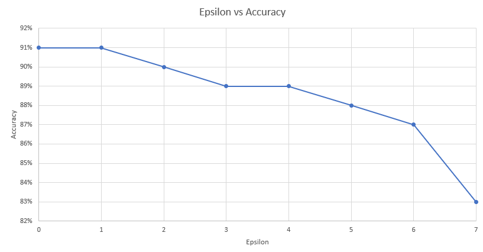
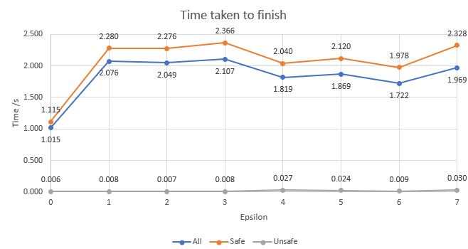
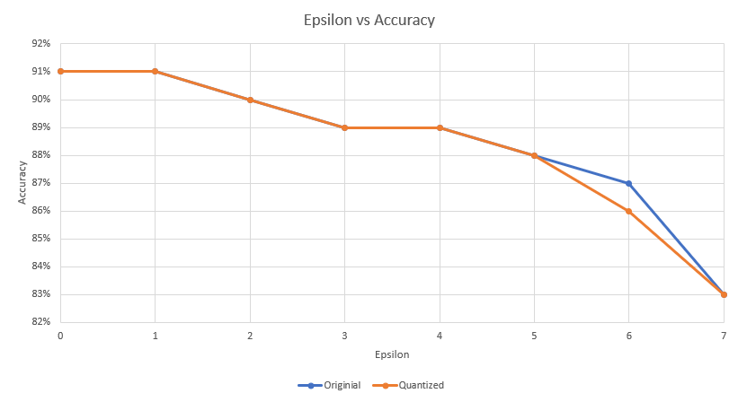
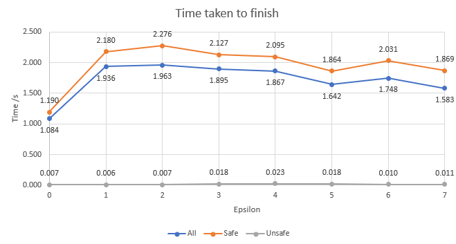
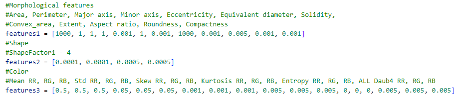
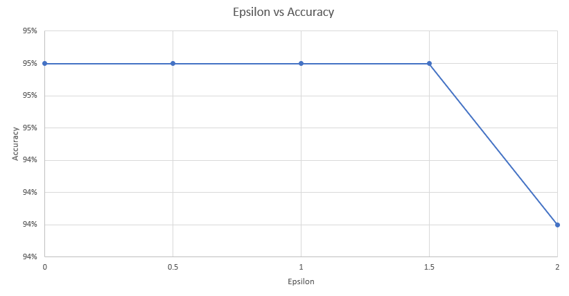
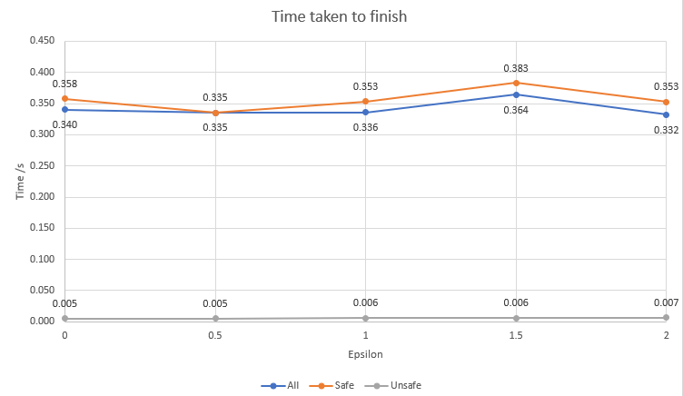
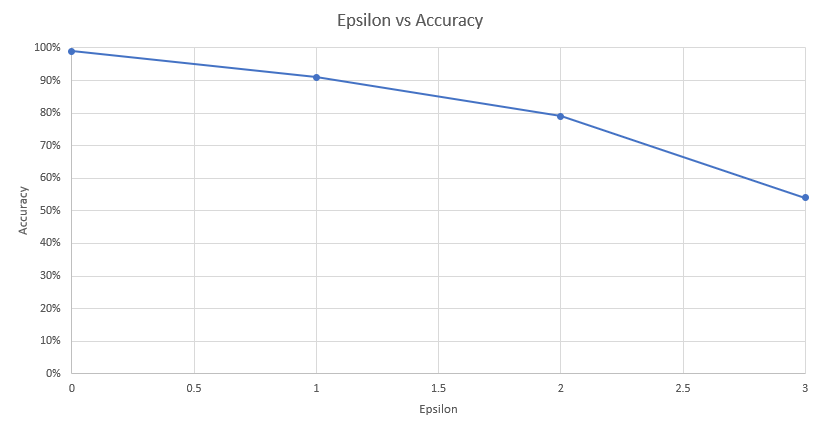
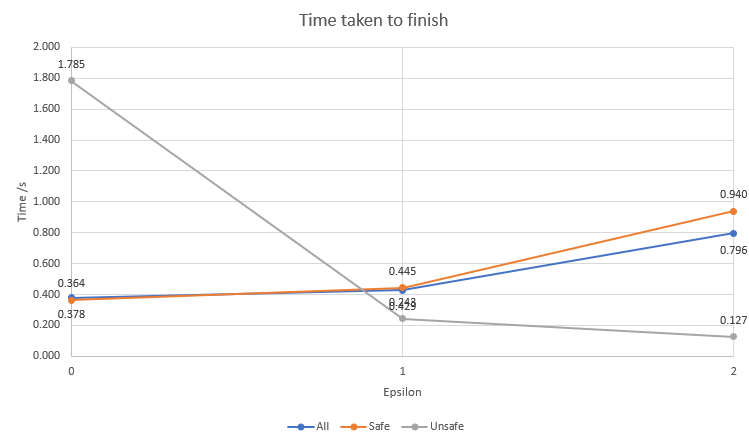

# Verified Models

Model  | Domain | Network Type | Size | Input Size and Type | Properties Verified | Source 
:-: | :-: | :-: | :-: | :-: | :-: | :-: |
Heart disease classification | Medical/disease identification [dataset](https://www.kaggle.com/datasets/johnsmith88/heart-disease-dataset) | MLP | 702, 0.00MB | Input size: 11: 7 numerical, 4 categorical | Robustness | [link](https://github.com/shubhahegde2002/Heart-Failure-Prediction-Using-PyTorch)
Heart disease classification - Quantized | Medical/disease identification [dataset](https://github.com/shubhahegde2002/Heart-Failure-Prediction-Using-PyTorch/blob/main/heart.csv) | MLP | 702, 0.00MB | Input size: 11: 7 numerical, 4 categorical | Robustness | Run .half() on above
Date fruit classification | Food classification [dataset](https://www.kaggle.com/datasets/muratkokludataset/date-fruit-datasets) | MLP | 325,007, 1.24MB | Input size: 34: 34 numerical | Robustness | [link](https://github.com/Lina-Gerontogianni/Dates-Fruit-classification---PyTorch)
Sign language classification | Hand gesture classifciation [dataset](https://www.kaggle.com/datasets/datamunge/sign-language-mnist) | MLP | 470,680, 1.80MB | Input size: 784: serialized 28 x 28 grey scale image | Robustness | [link](https://www.kaggle.com/code/asdpod/c-nn-sign-language-keras-vs-pytorch)

## Unverified Models
These are some models we tried to verify, but failed due to various reasons
Model  | Domain | Network Type | Size | Input Size and Type | Why failed | Source
:-: | :-: | :-: | :-: | :-: | :-: | :-: |
Brain tumor classification | Medical/tumor classification [dataset](https://www.kaggle.com/competitions/histopathologic-cancer-detection/overview) | CNN | 12,850,788, 49.02MB | Input size: 3 x 244 x 244: RGB image | Not enough memory | [link](https://www.kaggle.com/code/abdallahwagih/brain-tumor-classification-pytorch)
Natural image classification | Image classification [dataset]() | CNN | 199,568, 0.78MB | Input size: 3 x 128 x 128: RGB image | Not enough memory | [link](https://www.kaggle.com/code/androbomb/using-cnn-to-classify-images-w-pytorch)
Fake image detection | Image classification [dataset](https://www.kaggle.com/datasets/sophatvathana/casia-dataset) | CNN | 14,825,714, 56.56MB | Input size: 3 x 128 x 128: RGB image | Not enough memory | [link](https://github.com/z1311/Image-Manipulation-Detection)
Cancer detection | Medical/disease identification [dataset](https://www.kaggle.com/competitions/histopathologic-cancer-detection) | CNN | 31,230, 0.12MB | Input size: 784: serialized 28 x 28 grey scale image | Not enough memory | [link](https://www.kaggle.com/code/shtrausslearning/pytorch-cnn-binary-image-classification)
And many more...

# Motivation

* Heart disease classification: This is a simple MLP model that takes in some numerical data and some categorical data as input and outputs a binary classification of whether the patient has heart disease or not. 
* Heart disease classification - Quantized: Quantization is a way of reducing the size of models. It is usually done by reducing the precision of weight parameters and hence reducing the number of bytes required to store them as well as reducing the computation time. Therefore it is interesting to check if robustness is maintained through the quantinization as well as the time spent to check those models.
* Date fruit classification: Instead of a binary classificaiton, this model is classifying the date type out of the 7 available choice. Since non-binary classification is generally harder than binary ones, we can then check if such model is robust under preturbation of input. At the same time, all of its input are numerical data hence we can preturb them all by a given amount to see if anything change to the output or not.
* Sign language classification: Different from the previous models, this one takes a serialized grey scale image as its input. Therefore, all of its input is bounded between 0 and 1. Therefore, we can preturb all of the input pixel using the same scale. For instance, we can add/subtract all pixel by 1/255 to see if that will affect the result or not.
* 2DCNNs: CNN works differently than regular mlps, the use of kernels in convolution layers can capture some spacial representations of colors within the image. So it would be interesting to test if regular preturbation of input will affect the output that much or not. Moreover, the use of poolling is also common in CNN, and we hope to see how that may or may not affect the robustness of the model
* Fake image detection: With the increasing use of AI in arts and photo editing domain, one potential problem that we need to solve is to identify which ones are real and which ones are not. Using CNN based fake image detection algorithm is one possible solution. So we would like to verify how these algorithm behaves under some preturbation of input. However, it will also be interesting to inverstigate if our preturbation will be identified as making the image fake. And we can inverstigate if that is a good thing or bad thing.

##
Despite our effort to verify the robustenss of the CNNs, we are unable to make the alpha-beta-crown to verify these models. Most of the problem comes down to the extensive amount of memory required in verifying the maxpool2d or batchnormalization layers. Even running on UVA jaguar06 with 48GB CUDA memory, the algorithm still reports not enough memory.

# Results

1. Heart disease classification: For this model, we have decided to preturb 5 of the numerical inputs: age, resting blood pressure in mmHg, serum cholestoral in mg/dl, max heart rate and ST depression induced by exercise relative to rest. For the first 4, we decided to preturb them on a base scale of 1, and for the last, we preturb it by 0.1 at a time. The amount of preturbation is controlled by parameter epsilon which we slowly increase it from 0 to 7 for the first 100 input samples to check the change in accuracy across the model. We also tried to to change epsilon on the first insance until a counter exmaple is found.

    

    Epsilon | 0 | 1 | 2 | 3 | 4 | 5 | 6 | 7 |
    :-: | :-: | :-: | :-: | :-: | :-: | :-: | :-: | :-: |
    Accuracy | 91% | 91% | 90% | 89% | 89% | 88% | 87% | 83% |

    We noticed that even when epsilon is 0, there still exists 9% unsafe instance. From investigation, we found out that those are the cases where the model produced a wrong prediction in the first place. In other words, counter exmaples are starting to be found when epsilon = 2 and continue to increase as epsilon increases. In our opinion, this model is not very robust given that the preturbed inputs: heart rate, resting blood pressure, max heart rate may very likely to vary a bit from time to time.

    

    In terms of the time required, in the beginning as epsilon increases, the time required increases as more data is available to test for counter examples. Then later on, the time required between epsilons stables and gradually decreases. The decrease is due to more counter examples being found by PGD attack which can skip the need for other verifiers. 

    Then for testing on the first instance only, we found that a counter example is only found when epsilon = 21, for the original tensor [[ 40., 0., 0., 140., 289., 0., 0., 172., 0., 0., 0.]], the counter example is found when with [[ 19., 0., 0., 119., 310., 0., 0., 151., 0., -2.1, 0.]]

2. Heart disease classification - Quantized: We obtained this model by running .half() on the previous model obtained in order to reduce the parameters from 32bit floating point down to 16bit, as a result, the model weight reduced from 5.5KB down to 4.0KB. We then did the same test as the previous one to see if there are any difference betweent he two.

    

    Epsilon | 0 | 1 | 2 | 3 | 4 | 5 | 6 | 7 |
    :-: | :-: | :-: | :-: | :-: | :-: | :-: | :-: | :-: |
    Accuracy | 91% | 91% | 90% | 89% | 89% | 88% | 86% | 83% |

    As a result, most of the inputs remained the same between the model except one instance when epsilon = 6 where there is one more counter example found for one of the input instance. 
    
    

    As a comparison to the previous case, it seems like most of the time spent is about the same with a few cases where the quantized model takes about 0.5 seconds less. This shows some of the benefits brought by quantization.

    Testing on the first instance of the input, we found that a counterexample is only found at epsilon = 21 which matches the previous model result. Hence showing not much sacrifies to the robustness during quanization.

3. Date fruit classification: This model takes in 34 numerical inputs seprated into three categories: morphological features, shape features, color features. In which Morphological features contains 12 features including area, perimeter, major/minor axes etc.; shape features contains 4 features; and color features contains 6 features for each color with a total of 18 features. We have decided to use the following base scale to preturb our input with controlled epsilon from 0 to 2 with an increase of 0.5 each time:
    

    We also measured the accuracy and time required to verify first 100 instances of the input in this case.

    

    Epsilon | 0 | 0.5 | 1 | 1.5 | 2 |
    :-: | :-: | :-: | :-: | :-: | :-: |
    Accuracy | 95% | 95% | 95% | 95% | 94% |

    In this case, it seems like a counter example is only being found at epsilon = 2 given how much we are preturbing some of the values of the input. We think this may be caused by 
     However, it is also worth noticing that all of the "base scale" are defined by ourselves so maybe some inputs are not preturbed large enough compared to the some other inputs. Also They may differ from how these values may vary in real life. Despite these, we think that this model is realtively robust against preturbation of input.

    

    With not much change in the number of counter examples found, it is expected to see that the time spent between epsilons is relatively the same.

4. Sign language classification: This model takes in a serialized 28 x 28 grey scale image and try to identify which of the 26 letters of the english alphabet the gesture is showing. Since this model takes image as input, we can going to preturb all of its pixel by one bit of brightness at a time (1/255) to see how that will affect the result of the model.

    

    Epsilon | 0 | 1 | 2 | 3 |
    :-: | :-: | :-: | :-: | :-: |
    Accuracy | 99% | 91% | 79% | 55% |

    It is quite suprising to see that with such small change in each pixel, the model accuray decrease dramatically. Therefore, we think this model is robust. We think that there are a few reasons causing this. First of all, since we are only serializing the input, the spacial features are likely to be not captured by the model, leading to it relying on the actually value of each pixel more. Moreover, the small input dimension 28 x 28 may be purne to a small change in brightness.

    

    The time taken to verify in this case is also different. After removing some timed-out cases, the time required to identify unsafe cases decreases as epsilon increase. This is likley due to eaiser example to find. At the same time, the time taken to verify safe instance also increases due to the increase amount of space required to search. Eventually, if there are more failed cases, the average time should go back down.

# Conclusion
Overall, we have verified the heart disease model both oringinal and quantized version, date fruit multiclass mlp and a image classification model on sign language. We have found that our binary classification model is not robust against small preturbation of input that is likely to occur in real life. However, the quantized model despite using less memory, is able to preserve robustness nearly as well as the original without any significant sacrifies to accuracy, making it an viable option to use if memory and computing speed is importnat in different situations. For the non-binary classification MLP, we determined that it is pretty robust against preturbation of input and hence can be considered a robust model. However, we do acknowledge the fact that the "small" change in input are values chosen by ourselves which may differ from how those value varies in real life and lead to potential different result. At last, for the sign language classification model, we found that it is not robust at all and a very small change in input can dramtically reduce the accuracy of the model. Other than the reason discussed above, the amount classes 26 is also a factor impacting the robustness since the output space will be smaller for each class.
It is a shame that we are not able to verify any of the cnn models we planned to do as well as the fake image detection model. For next time if possible, we should consider back up verification tool in case of something similar happens. 